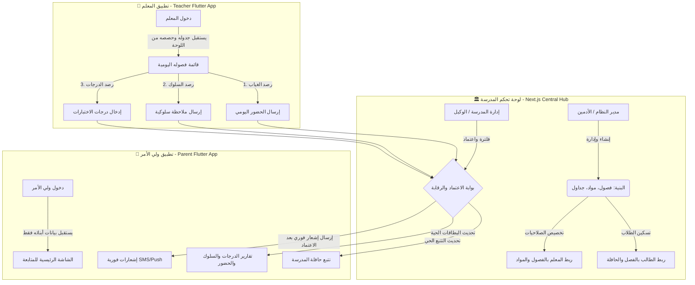

# 🏛️ الخطة الهندسية والتنفيذية الشاملة (Master Project & Architecture Plan)
## مشروع: لوحة تحكم الإدارة المدرسية الشاملة — EduBridge School Dashboard
**الإصدار:** 1.0 (Enterprise Gold Edition)  
**تاريخ الإعداد:** يوليو 2026  
**الدور المنفذ:** Senior Technical Project Manager & Chief Solutions Architect  
**التقنية المستهدفة:** Next.js (App Router, TypeScript, Custom Vanilla CSS/CSS Modules Design System)

---

## 📑 جدول المحتويات (Table of Contents)
1. **الرؤية الاستراتيجية وتحليل النظام البيئي (Ecosystem Vision & Analysis)**
2. **العلاقة التكاملية: كيف تدير اللوحة تطبيقي المعلم وولي الأمر؟ (Ecosystem Orchestration)**
3. **هيكل الصلاحيات وإدارة الأدوار (Role-Based Access Control - RBAC)**
4. **المخطط المعماري ودفق البيانات (System Architecture & Data Flow Diagram)**
5. **التوصيف الوظيفي الكامل للوحدات العشر (Detailed Functional Specifications)**
   - 5.1. إدارة البنية الأكاديمية (Academic Structure Hub)
   - 5.2. إدارة المعلمين والكوادر (Teacher & Staff Management)
   - 5.3. إدارة الطلاب وأولياء الأمور (Student & Parent Linking Engine)
   - 5.4. محرك الجداول الدراسية وتوزيع الحصص (Timetable & Scheduling Engine)
   - 5.5. مركز المراقبة السلوكية وشؤون الطلاب (Behavior & Discipline Center)
   - 5.6. نظام رصد الحضور والإنذارات المبكرة (Attendance & Risk Analytics)
   - 5.7. كنترول الدرجات والتقارير الأكاديمية (Gradebook & Report Cards Control)
   - 5.8. إدارة أسطول الحافلات والتتبع الحي (Fleet & Transportation Management)
   - 5.9. مركز الاتصال والرسائل الموجهة (Communication & Broadcast Hub)
   - 5.10. الذكاء الاصطناعي التربوي وتحليلات الأداء (AI Insights & Analytics Dashboard)
6. **هندسة البيانات ونماذج الـ Mock Data الجاهزة لقواعد البيانات (Database Schema Design)**
7. **هندسة واجهة المستخدم والهوية البصرية (Design System & UI Tokens)**
8. **خارطة الطريق التنفيذية لمرحلة الـ UI/UX Demo (Next.js Implementation Plan)**
9. **أسئلة للمراجعة والاعتماد (User Review & Sign-off)**

---

## 1. 🎯 الرؤية الاستراتيجية وتحليل النظام البيئي
تعتبر **لوحة تحكم إديو بريدج (EduBridge Dashboard)** هي "العقل المدبر" و"غرفة العمليات المركزية" للمدرسة الحديثة في السوق السعودي والخليجي. بينما يركز تطبيق المعلم على إدخال البيانات اليومية بسرعة (رصد حضور، كتابة ملاحظة)، ويركز تطبيق ولي الأمر على المتابعة والاطمئنان، تقع على عاتق لوحة التحكم المهام الاستراتيجية التالية:
* **الأتمتة الشاملة (Full Automation):** القضاء على العمليات الورقية والإدخال المزدوج من خلال ربط الهيكل الأكاديمي آلياً بالجدول اليومي للمعلم.
* **الرقابة والحوكمة (Governance & Quality Control):** أي درجة أو تقرير أو ملاحظة سلوكية عالية الخطورة تصدر من المعلم تمر أولاً على "فلاتر حوكمة" في لوحة التحكم (مثل اعتماد وكيل شؤون الطلاب) قبل أن تظهر في هاتف ولي الأمر.
* **الرؤية الشاملة (360° Visibility):** تمكين مدير المدرسة ومدير إدارة التعليم من رؤية مؤشرات الأداء الحية (KPIs) لكل فصل، معلم، أو طالب بضغطة زر واحدة.

---

## 2. 🔄 العلاقة التكاملية: كيف تدير اللوحة تطبيقي المعلم وولي الأمر؟



### دورة العمل المتكاملة (End-to-End Operational Lifecycle):
1. **مرحلة التأسيس (اللوحة):** يقوم مسؤول النظام بإنشاء العام الدراسي، الصفوف، والشعب (مثلاً: الصف الخامس / شعبة ب)، ثم يضيف المعلمين ويحدد أن "الأستاذ سامي" يدرّس "الرياضيات" للشعبة (ب).
2. **مرحلة التمكين (تطبيق المعلم):** بمجرد فتح الأستاذ سامي لتطبيقه صباحاً، يجد جدوله جاهزاً ومربوطاً بقائمة طلاب الشعبة (ب). يسجل الحضور ويرصد ملاحظة سلوكية للطالب "أحمد".
3. **مرحلة الحوكمة والتحليل (اللوحة):** تصل الملاحظة السلوكية فوراً إلى مركز شؤون الطلاب في لوحة التحكم. إذا كانت الملاحظة "عادية"، تُرَّحل تلقائياً. إذا كانت "شديدة الخطورة"، يتم تنبيه المشرف التربوي لاتخاذ إجراء أو إضافة توصية تربوية (كما رأينا في ميزة التوصيات في تطبيق ولي الأمر).
4. **مرحلة الأثر (تطبيق ولي الأمر):** يتلقى ولي الأمر إشعاراً جذاباً ومنظماً على هاتفه يحتوي على الملاحظة + التوصية التربوية + رابط مباشر للمتابعة.

---

## 3. 🛡️ هيكل الصلاحيات وإدارة الأدوار (Role-Based Access Control)
لتجنب الفوضى في الإدارة المدرسية، تعتمد اللوحة على 4 أدوار رئيسية (س يتم تضمينها في نظام الـ Demo للتبديل بينها وعرض اختلاف الصلاحيات):

| الدور (Role) | المسمى الوظيفي | الصلاحيات والمناطق المتاحة في اللوحة |
| :--- | :--- | :--- |
| **Super Admin** | **مدير المدرسة / قائد المجمع** | صلاحيات كاملة (100%): الوصول للإحصاءات المالية، الأداء العام، تقييم المعلمين، إعدادات المدرسة، وإتخاذ القرارات الحساسة. |
| **Academic Supervisor** | **وكيل شؤون الطلاب / المشرف التربوي** | صلاحيات إدارة الطلاب، مراقبة الغياب والإنذارات، مراجعة واعتماد الملاحظات السلوكية، وإدارة الجداول والاختبارات. |
| **HR & Admin Officer** | **مسؤول شؤون الموظفين والتسجيل** | صلاحيات إضافة المعلمين، تسجيل الطلاب الجدُد، ربط أولياء الأمور (Family Linking)، وإصدار البطاقات والتعريفات. |
| **Fleet Manager** | **مسؤول النقل والحافلات** | صلاحيات محصورة في إدارة خطوط السير، توزيع الطلاب على الحافلات، تتبع السائقين، وإدارة تنبيهات الـ GPS. |

---

## 4. 🧩 التوصيف الوظيفي الكامل للوحدات العشر (Detailed Modules Spec)

### 5.1. إدارة البنية الأكاديمية (Academic Structure Hub)
* **الوظيفة:** بناء الهرم التعليمي للمدرسة الذي ينبنى عليه كل شيء.
* **الخصائص:**
  * إدارة الأعوام الدراسية والفصول الدراسية (الترم الأول، الثاني، الثالث).
  * إنشاء المراحل الدراسية (ابتدائي، متوسط، ثانوي) والصفوف (الأول، الثاني...).
  * إدارة الفصول / الشعب (Sections): تحديد سعة الفصل، غرفة الدراسة، ومربّي الفصل (Classroom Teacher).
  * دليل المواد الدراسية (Subjects Catalog): تعريف المواد (رياضيات، علوم، تربية بدنية) وتحديد نصاب الحصص الأسبوعي لكل مادة.

### 5.2. إدارة المعلمين والكوادر (Teacher & Staff Management)
* **الوظيفة:** الملف الشامل لكل معلم وإدارة أنصبتهم الدراسية.
* **الخصائص:**
  * استعراض بطاقة المعلم (الاسم، التخصص، رقم الهاتف، الإيميل، الصورة).
  * نظام التعيين الأكاديمي (Assignment Matrix): تحديد ماذا يدرّس المعلم؟ ولأي الفصول؟ (مثلاً: الأستاذ علي -> تربية بدنية -> الصفوف 4، 5، 6).
  * مؤشّرات أداء المعلم (Teacher KPI): نسبة التزام المعلم برصد الحضور اليومي، عدد الملاحظات السلوكية التي رصدها، وسرعة إدخاله للدرجات.

### 5.3. إدارة الطلاب وأولياء الأمور (Student & Parent Linking Engine)
* **الوظيفة:** إدارة قاعدة بيانات الطلاب وربطها عائلياً بأولياء الأمور لضمان أمان البيانات.
* **الخصائص:**
  * الملف الشامل للطالب (البيانات الأساسية، الفصل الحالي، الحالة الطبية، تاريخ التسجيل).
  * **محرك الربط العائلي (Family Linking):** ربط أكثر من طالب بولي أمر واحد (مثلاً: أحمد في الخامس، وسارة في الثاني -> كلاهما يظهران في تطبيق ولي أمر واحد بموجب رقم الهوية أو رقم الجوال).
  * نقل الطلاب بين الشعب، وإصدار شهادات التعريف أو بطاقات الصعود للحافلة.

### 5.4. محرك الجداول الدراسية وتوزيع الحصص (Timetable & Scheduling Engine)
* **الوظيفة:** العصب التشغيلي الذي يحدد جدول كل فصل وجدول كل معلم.
* **الخصائص:**
  * واجهة بناء الجدول الأسبوعي (توزيع الحصص من الأحد إلى الخميس، من الحصة 1 إلى 7).
  * كاشف التعارض الذكي (Conflict Detector): تنبيه فوري إذا تم إسناد المعلم لـ فصلين في نفس الحصة، أو إذا تجاوز المعلم نصابه الأسبوعي.
  * إدارة حصص الاحتياط والتبديل المؤقت عند غياب أحد المعلمين.

### 5.5. مركز المراقبة السلوكية وشؤون الطلاب (Behavior & Discipline Center)
* **الوظيفة:** شاشة القيادة المباشرة لمتابعة سلوكيات الطلاب المرفوعة من المعلمين وإدارة التوصيات.
* **الخصائص:**
  * بث حي (Live Feed) لكافة الملاحظات المرفوعة من تطبيق المعلمين.
  * تصنيف حسب الدرجة: (منخفض - أزرق / متوسط - برتقالي / عالي - أحمر حرج).
  * **نظام إدارة التوصيات التربوية (Recommendation Engine):** إمكانية إرفاق الإدارة لفيديو توعوي أو خطة إصلاحية للملاحظة قبل إرسالها لولي الأمر (وهو ما يميز نظام إديو بريدج كما تم إبرازه في Pitch Deck).
  * متابعة حالة الملاحظة (مفتوحة، قيد المعالجة، محلولة، تم اطلاع ولي الأمر).

### 5.6. نظام رصد الحضور والإنذارات المبكرة (Attendance & Risk Analytics)
* **الوظيفة:** لوحة إحصاءات الغياب اليومي للمدرسة وحماية الطلاب من التعثر.
* **الخصائص:**
  * عداد فوري لنسبة الحضور العام اليوم (مثلاً: 96.5% حضور، 3.5% غياب).
  * سجل الغياب والتأخر الصباحي مفصلاً حسب الفصول.
  * **نظام الإنذار الآلي (Automated Risk Alerts):** اكتشاف الطلاب الذين تجاوز غيابهم 3 أيام أو 5 أيام متتالية، وإصدار تنبيهات تلقائية لإرسال رسالة استدعاء لولي الأمر.
  * قبول وتدقيق الأعذار الطبية المرفوعة.

### 5.7. كنترول الدرجات والتقارير الأكاديمية (Gradebook & Report Cards Control)
* **الوظيفة:** إدارة التقييمات، الامتحانات الدورية، وتقارير منتصف ونهاية الفصل.
* **الخصائص:**
  * إعداد قوالب التقييم (اختبار الوحدة، أعمال السنة، منتصف الفصل، النهائي).
  * شاشة تدقيق واعتماد الدرجات (Grade Verification): مراجعة الدرجات المدخلة من المعلمين واعتمادها نهائياً قبل نشرها على تطبيق ولي الأمر.
  * إصدار شهادات الدرجات وبطاقات الأداء التفاعلية (Report Cards Generator).

### 5.8. إدارة أسطول الحافلات والتتبع الحي (Fleet & Transportation Management)
* **الوظيفة:** واجهة التحكم في نقل الطلاب لضمان سلامتهم وطمأنينة أولياء الأمور.
* **الخصائص:**
  * إدارة الحافلات (رقم اللوحة، اسم السائق، رقم هاتفه، المشرف المرافق).
  * تخطيط المسار (Route Mapping): ربط مجموعة طلاب بمسار حافلة معين (مثلاً: مسار حي الياسمين - حافلة 4).
  * محاكاة حالة الحافلة (في المدرسة، في الطريق، انطلقت) والتي تنعكس مباشرة على شاشة التتبع في تطبيق ولي الأمر.

### 5.9. مركز الاتصال والرسائل الموجهة (Communication & Broadcast Hub)
* **الوظيفة:** قناة التواصل الرسمية المباشرة مع أولياء الأمور والمعلمين.
* **الخصائص:**
  * إرسال تعاميم وإشعارات (Push Notifications & SMS) موجهة لـ: (كل المدرسة، صف معين، فصل معين، أو أولياء أمور طلاب محددين).
  * إدارة التقويم المدرسي والفعاليات (أيام القياس، مجالس الآباء، الرحلات المدرسية).
  * قوالب رسائل جاهزة (مثل: تهنئة تفوق، تنبيه غياب، تذكير بموعد انصراف مبكر).

### 5.10. الذكاء الاصطناعي التربوي وتحليلات الأداء (AI Insights & Analytics Dashboard)
* **الوظيفة:** تقديم تحليلات عليا متقدمة لمتخذي القرار (الإدارة ووزارة التعليم).
* **الخصائص:**
  * مؤشر الصحة الأكاديمية للمدرسة (Academic Health Index).
  * **مصفوفة المخاطر التربوية (AI Risk Scoring):** خوارزمية تكتشف الطلاب المعرضين للتراجع الدراسي أو التسرب بناءً على دمج بيانات (الغياب + انخفاض الدرجات + الملاحظات السلوكية السلبية).
  * مقارنات الأداء بين الشعب والمعلمين لتحديد نقاط القوة ومواطن التطوير.

---

## 6. 🗄️ هندسة البيانات ونماذج الـ Mock Data الجاهزة لقواعد البيانات (Database Schema Design)
لضمان أن يكون نظام الـ Demo في Next.js جاهزاً بنسبة 100% للاستبدال بقاعدة بيانات حقيقية (مثل PostgreSQL أو MongoDB أو Firebase) دون تغيير مكونات الواجهة، تم تصميم هيكل البيانات العلائقي بصرامة باستخدام TypeScript Interfaces:

```typescript
// ── 1. Academic Structure ──────────────────────────────────────────
export interface SchoolSection {
  id: string;
  name: string; // e.g., "الصف الخامس / شعبة ب"
  gradeLevel: string; // e.g., "الصف الخامس"
  roomNumber: string;
  capacity: number;
  enrolledCount: number;
  classTeacherId: string; // FK to Teacher
  classTeacherName: string;
}

export interface Subject {
  id: string;
  name: string; // e.g., "الرياضيات"
  code: string; // e.g., "MATH101"
  weeklyPeriods: number;
  icon: string;
  color: string; // Hex color matching mobile theme
}

// ── 2. Staff & Teachers ────────────────────────────────────────────
export interface Teacher {
  id: string;
  name: string; // e.g., "الأستاذ سامي"
  email: string;
  phone: string;
  avatarUrl: string;
  specialization: string;
  assignedSections: string[]; // Section IDs
  assignedSubjects: string[]; // Subject IDs
  kpiScore: number; // e.g., 98%
  activeStatus: 'active' | 'on_leave' | 'inactive';
}

// ── 3. Students & Parents ──────────────────────────────────────────
export interface Parent {
  id: string;
  nationalId: string;
  name: string; // e.g., "محمد علي"
  phone: string;
  email: string;
  childrenIds: string[]; // Array of Student IDs (Family Link)
}

export interface Student {
  id: string;
  studentCode: string; // e.g., "STU-12345"
  name: string; // e.g., "أحمد محمد علي"
  avatarUrl: string;
  gradeLevel: string;
  sectionId: string; // FK to SchoolSection
  sectionName: string;
  parentId: string; // FK to Parent
  busRouteId?: string; // Optional FK to BusRoute
  academicScore: number; // Percentage e.g., 89%
  attendanceRate: number; // Percentage e.g., 96%
  riskLevel: 'low' | 'medium' | 'high';
}

// ── 4. Behavior & Discipline ───────────────────────────────────────
export interface BehaviorNote {
  id: string;
  studentId: string;
  studentName: string;
  studentSection: string;
  teacherId: string;
  teacherName: string;
  teacherRole: string;
  title: string;
  excerpt: string;
  description: string;
  severityLabel: 'منخفض' | 'متوسط' | 'عالي';
  severityColor: string; // e.g., "#EF4444"
  statusLabel: 'مفتوحة' | 'قيد المعالجة' | 'محلولة';
  statusColor: string;
  date: string;
  recommendations: {
    title: string;
    description: string;
    hasVideo: boolean;
  }[];
}

// ── 5. Attendance & Bus Tracking ───────────────────────────────────
export interface AttendanceRecord {
  id: string;
  date: string;
  sectionId: string;
  studentId: string;
  status: 'present' | 'absent' | 'late' | 'excused';
  notes?: string;
}

export interface BusRoute {
  id: string;
  routeName: string; // e.g., "مسار حي الياسمين - رقم 4"
  plateNumber: string; // e.g., "أ ب ج - 1234"
  driverName: string;
  driverPhone: string;
  status: 'in_school' | 'on_route' | 'arrived';
  assignedStudentsCount: number;
}
```

---

## 7. 🎨 هندسة واجهة المستخدم والهوية البصرية (Design System & UI Tokens)
التزاماً بتعليمات بناء الـ Web Apps، سيتم بناء نظام الألوان والتصميم باستخدام Vanilla CSS / CSS Custom Properties في ملف `globals.css` لضمان السلاسة، الأداء الخارق، والمرونة التامة دون تعقيدات خارجية:

### الهوية اللونية (EduBridge Official Palette):
* **Primary Blue (`#176B9A`):** اللون الأساسي للأشرطة العلوية، الأزرار الاستراتيجية، والأيقونات النشطة.
* **Accent Green (`#7CC341`):** لون النجاح، الحضور، الحالات الحية (Live Badge)، وأزرار الإنجاز.
* **Text Dark (`#123C56`):** لون العناوين الرئيسية والنصوص الأساسية لضمان تباين عالٍ وقراءة مريحة.
* **Text Light (`#6B8A9C`):** لون النصوص الفرعية، التواريخ، والبيانات الوصفية.
* **Page Background (`#F5FAFC`):** لون خلفية اللوحة الهادئ جداً (Cool White Tint) الذي يمنع إجهاد العين خلال ساعات العمل الطويلة.
* **Surface White (`#FFFFFF`):** خلفية الكروت والألواح مع حواف ناعمة بقطر `16px` إلى `20px` وحدود دقيقة بلون `#E2EAF0`.

### المكونات البصرية الحصرية في اللوحة (Visual UI Components):
1. **Sidebar Navigation (القائمة الجانبية الذكية):** تحتوي على شعار إديو بريدج، تبويبات التنقل العشرة مع أيقونات معبرة (من `lucide-react`)، ومؤشر الصلاحية الحالي.
2. **Top Executive Bar (الشريط العلوي):** يحتوي على بحث سريع وشامل (Global Search) للبحث عن أي طالب أو معلم برقم الهوية أو الاسم، إشعارات النظام، وزر التبديل بين الأدوار (Role Switcher - لعرض واجهة المدير مقابل واجهة المشرف أو مسؤول النقل).
3. **Executive KPI Cards (بطاقات المؤشرات العليا):** كروت تتصدر الشاشة الرئيسية تعرض (إجمالي الطلاب، إجمالي المعلمين، نسبة الحضور اليوم، عدد الملاحظات المعلقة) مع مؤشرات نمو وسهام تفاعلية.
4. **Interactive Data Tables (جداول البيانات المتقدمة):** جداول مجهزة بخصائص البحث، الفلترة حسب الصف والشعبة، الترتيب (Sorting)، وأزرار الإجراءات السريعة (عرض الملف، تعديل، مراسلة ولي الأمر).

---

## 8. 🗺️ خارطة الطريق التنفيذية لمرحلة الـ UI/UX Demo (Next.js Implementation Plan)

سنقوم بتنفيذ اللوحة داخل المجلد المحدد `D:\android tog\edubridge_dashboard` وفق معايير برمجية فائقة الجودة:

### المرحلة الأولى: تأسيس المشروع والبنية التحتية (Project Initialization)
* [ ] إنشاء تطبيق Next.js جديد داخل `D:\android tog\edubridge_dashboard` مع تفعيل TypeScript و App Router.
* [ ] تجهيز ملف `src/app/globals.css` بجميع المتغيرات اللونية (Design Tokens) وتنسيقات الخطوط (Cairo Font) والأنماط المشتركة (Utility Classes & Card Styles).
* [ ] تجهيز مجلد `src/data/mockData.ts` المحتوي على بيانات افتراضية واقعية جداً لـ (الطلاب، المعلمين، الفصول، الملاحظات السلوكية، مسارات الحافلات، وأولياء الأمور) جاهزة للربط الفوري.

### المرحلة الثانية: بناء المكونات الأساسية والشاشة المركزية (Core Shell & Dashboard Home)
* [ ] تطوير مكون `Sidebar` (القائمة الجانبية) مع أسلوب تنقل تفاعلي سلس.
* [ ] تطوير مكون `Header` مع خاصية البحث السريع ومحاكي تبديل الأدوار (Role Switcher).
* [ ] تطوير الشاشة الرئيسية (Executive Dashboard View) المحتوية على بطاقات الـ KPIs، رسم بياني للحضور اليومي، وقائمة أحدث الملاحظات السلوكية الحرجة.

### المرحلة الثالثة: تطوير شاشات الوحدات التشغيلية (Modules Implementation)
* [ ] **شاشة إدارة الطلاب وأولياء الأمور (`/students`):** جدول استعراض الطلاب، بطاقة تعريف الطالب المفصلة، وعرض الربط العائلي.
* [ ] **شاشة إدارة المعلمين والتسكين (`/teachers`):** قائمة المعلمين، أنصبتهم، ومؤشرات أدائهم.
* [ ] **شاشة البنية الأكاديمية والجداول (`/academic` & `/schedule`):** استعراض الصفوف والشعب والجدول التفاعلي الأسبوعي.
* [ ] **شاشة شؤون الطلاب والمراقبة السلوكية (`/behavior`):** مركز التحكم في الملاحظات، فلترة الخطورة، وإدارة التوصيات التربوية.
* [ ] **شاشة الحضور والإنذارات المبكرة (`/attendance`):** سجل رصد الحضور اليومي وقائمة إنذارات الغياب الآلية.
* [ ] **شاشة تتبع الحافلات والأسطول (`/transport`):** إدارة مسارات الحافلات ومحاكاة التتبع الحي المطابق لتطبيق ولي الأمر.
* [ ] **شاشة مركز التعاميم والرسائل (`/messages`):** واجهة إرسال التنبيهات الموجهة واختيار الفئة المستهدفة.
